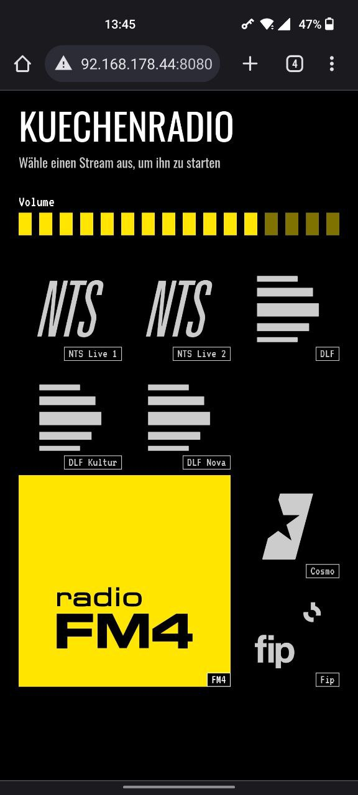

# rpi-radio
A server-client radio for raspberry pi which can play internet radio and local mp3 files.

Frontend uses Node.js and Vue.js and runs on port 8080 in a docker container.

Backend uses Node.js and mpd-api and runs on port 3000. Backend uses MPD to play streams.

## Prerequisites
- mpd

### Changing streams
You can change the audio streams by editing `streams.json` and `mpd/playlists/streams.m3u`. Be sure to exchange the svg icons.

You can add your own mp3 files in mpd/music/.

### Set up mpd
- delete contents of mpd/db/mpd-db
- adjust absolute paths in mpd.conf to your system
- create symlink to mpd.conf in ~/.config/mpd/mpd.conf
- automatically start mpd on startup with `systemctl enable --user mpd`

## Running in production
### Start backend and frontend
- Enable docker start on startup: `sudo systemctl enable docker`
- Run `docker compose -f docker-compose-pi.yml up -d` 
### Use radio
- Go to <ip-of-pi>:8080 with your browser and start a stream

